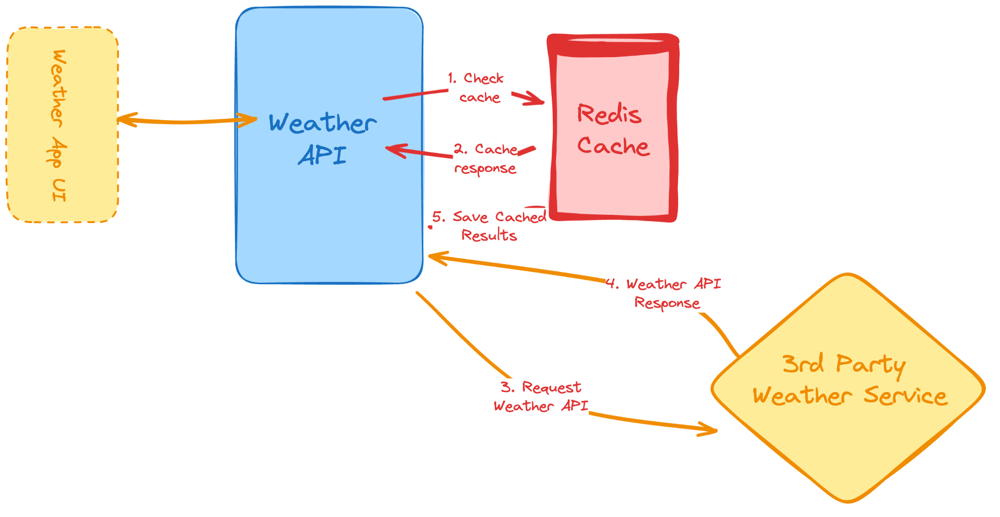

## Demostración 

# Weather API 

Este proyecto consiste en integrar la API de visualcrossing para consultar el clima en una localidad chilena, utilizando 
un sistema de cache en Redis.

**Se utiliza Memurai** para levantar el servidor  de Redis

